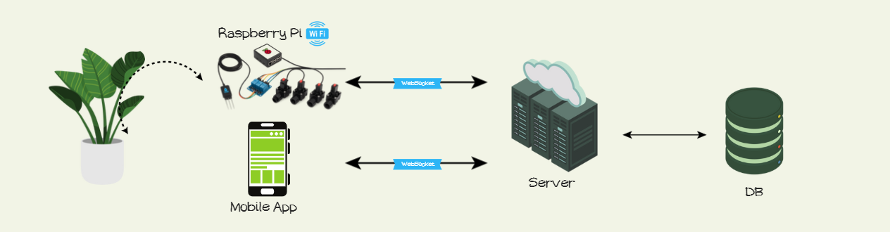

<h1 align="center">
  <br/>
  🌱 Smart Garden Project
   <br/>
   <br/>
  
</h1>

<h2 align="center">
  An automated system for optimized gardening!
</h2>

<br/>

## **Project Overview 🌿**

The Smart Garden Project is designed to simplify gardening with automated irrigation, real-time monitoring, and AI-powered plant care suggestions. The system ensures plant health while conserving water and providing actionable insights.


## Problem & Solution ❗✅

Conventional irrigation is timer‑based and blind to soil moisture and weather, causing over/under‑watering and water waste. Smart Garden pairs soil‑moisture sensing with a weather‑aware algorithm on a Raspberry Pi controller and a real‑time mobile app, so the system decides when and how much to water, actuates valves, and gives users full visibility, alerts, and manual control.

## **Key Features 🌟**

-  **Smart irrigation**: Moisture sensors inform the algorithm; forecasted rain can skip cycles.  
-  **Manual control & schedules**: Start watering instantly or configure recurring schedules.  
-  **Real-time monitoring**: Live moisture/temperature per plant, irrigation progress, and history.  
-  **AI plant identification**: Upload a photo; get species and care suggestions.  
-  **Reliability & diagnostics**: Detect blocked valves or sensor faults and guide recovery.  
-  **Multi-user per garden**: One controller, multiple simultaneous users with synced updates.  
-  **Multi-garden support**: Server routes per `garden/controller` to isolate data across many gardens.  
-  **Hardware scalability**: From a single pot to an orchard; same architecture works at all scales.  


## **Technology Stack 🛠️**

-  **Hardware**: Raspberry Pi + RS-485 soil moisture sensors + RS485 converter + 4‑channel relay (solenoid valves).  
-  **Controller**: Python (asyncio), Modbus RTU (RS‑485), WebSockets to the server.  
-  **Backend**: Node.js + Express + WebSocket (hosted on Google Cloud Run).  
-  **Database**: PostgreSQL (gardens, users, plants, sessions, schedules, irrigation logs/history, alerts).  
-  **Frontend**: React Native for mobile app development.  
-  **APIs**: OpenWeatherMap (weather), Plant.id (plant recognition), OpenAI (assistant/processing)
  


## 🎬 Live Demo

[Watch the demo](https://youtube.com/shorts/Xkjk_uE15Jg?si=VoNHfI56pmuT_Bup)

## 🚀 Quick Start

Backend is already hosted on Google Cloud Run. Run only the simulator controller and the mobile app locally.

### Prerequisites
- Simulator Web: Node.js 18+
- Mobile app: Node.js 18+, Expo CLI

### 1) Run the web simulator (no hardware required)
```bash
cd simulator-controller
npm install
npm run dev
```
Open the URL shown by Vite (typically http://localhost:5173). In the simulator UI:
- Click Connect to establish a WebSocket to the backend (Cloud Run by default)
- Enter your family_code from the app and click "Connect as PI" (sends PI_CONNECT)

### 2) Run the mobile app
```bash
cd client
npm install
npx expo start
```

Notes:
- The simulator connects per family_code. In the app: Garden → Settings → Family code. Use that code in the simulator to link to the correct garden.


## **System Architecture 🧩**

This section describes the main components of the Smart Garden system.


-  **Hardware (Raspberry Pi + sensors + relays)**  
   - One Pi per garden; connects over Wi‑Fi to the cloud backend.  
   - RS‑485 soil‑moisture (and temperature) sensors read by a Python controller.  
   - 4‑channel relay drives solenoid water valves via a `Valve` abstraction (open/close with safety timeouts).  
   - Local smart‑irrigation algorithm: compares current moisture to plant target, references forecast (rain‑skip), waters in short pulses, and stops when the target is reached or a water‑limit is hit.  
   - Reliability: blocked‑valve detection with restart check, power‑supply and connection self‑tests, and graceful shutdown that closes valves.  
    
-  **Server (Node.js + PostgreSQL on Google Cloud Run)**  
   - Acts as a WebSocket hub between mobile clients and garden controllers.  
   - Persists gardens, users, plants, sessions, schedules, irrigation logs/history, and alerts in PostgreSQL.  
   - Features: authentication/session handling, multi‑tenancy (multi‑garden, multi‑user), schedule execution, and broadcast of plant/irrigation updates to all connected users of a garden.  
   - Integrations with APIs mentioned before.  
   - Deployed on Google Cloud Run; horizontally scalable stateless API with DB‑backed state.  

-  **Mobile App (React Native)**  
   - Real‑time WebSocket client shows current moisture/temperature, valve status, and irrigation progress per plant.  
   - Controls: start/stop manual watering with duration, edit schedules, update plant targets, run diagnostics.  
   - AI flows: identify plant from photo and prefill care suggestions.  
   - Multi‑user per garden: all users see synchronized updates.  

<p align="center">
  
</p>

### Repository Structure (Top‑level) 🗂️

```text
Smart-Garden/
├─ app backend/                 # Node.js backend (Cloud Run)
├─ client/                      # React Native mobile app
├─ controller/                  # Python Pi controller (can run locally)
├─ simulator-controller/        # Web simulator for the controller 
```

<br/>

# **Credits** <a name="credits"/>
> Created by: Yael Yakobovich & Elizabeth Ashurov

<br/>
